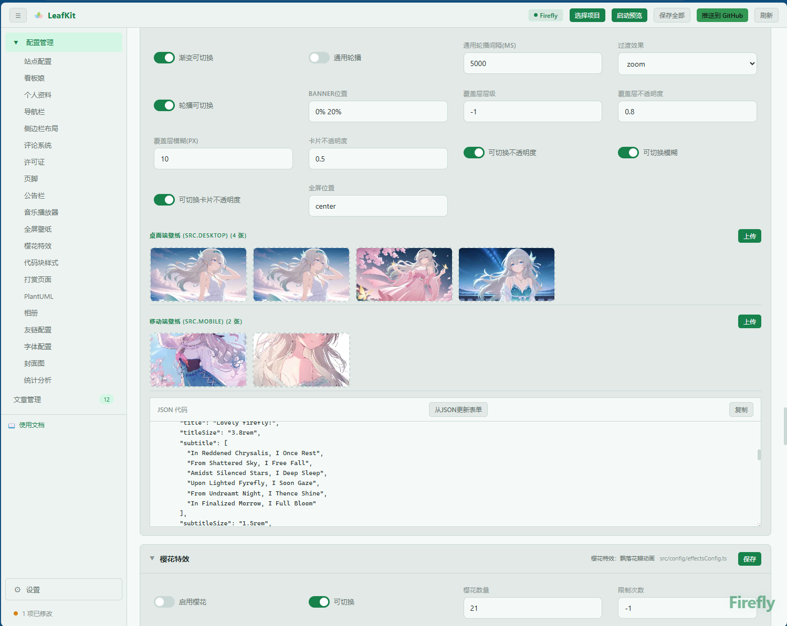
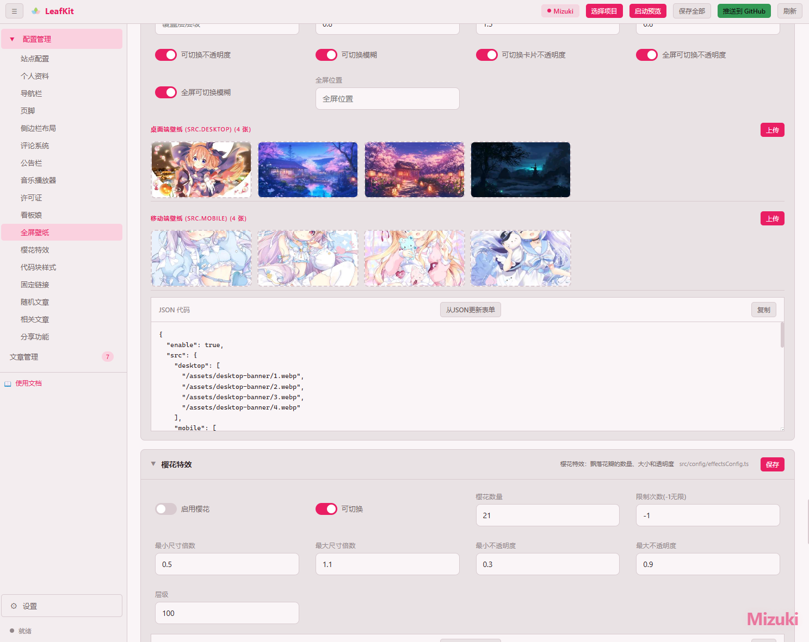

<div align="center">
  <br>

  
  
</div>

LeafKit 是一个可视化博客配置与文章编辑器，适配 Firefly、Mizuki、Fuwari 三款 Astro 博客主题。通过表单化界面编辑 TypeScript 配置文件和管理 Markdown 文章，避免直接修改代码。

## 适配的博客主题

 - Fuwari: https://github.com/saicaca/fuwari
 - Mizuki: https://github.com/LyraVoid/Mizuki
 - Firefly: https://github.com/CuteLeaf/Firefly

## 功能

- 表单化编辑博客 TypeScript 配置文件
- Markdown 文章管理（新建、编辑、预览、删除）
- 图片资源上传与管理（壁纸、图库）
- 内置 Git 推送部署

## 界面截图

<div align="center">
  <p><b>Firefly 平台</b></p>
  
  <br><br>
  <p><b>Mizuki 平台</b></p>
  
</div>

## 使用

### 环境

- Node.js 18+
- 基于 Firefly / Mizuki / Fuwari 的 Astro 博客项目

### 启动

```bash
git clone git@github.com:FarasMoon/Leaf-Kit.git
cd blog-editor
node server.cjs
```

Windows 下可直接双击 `start.bat`。服务运行在 `http://localhost:6299`。

### 流程

1. 浏览器打开 `http://localhost:6299`
2. 选择你的博客项目文件夹（首次需授权，后续自动记住）
3. LeafKit 自动识别博客平台，也可手动切换
4. 左侧边栏选择配置项或进入文章管理
5. 编辑后保存，配置写回原始 `.ts` 文件
6. 点击「预览」启动本地预览，「推送」部署到 GitHub

## 新增博客平台

LeafKit 通过元数据驱动的方式支持博客平台扩展。新增一个博客平台只需注册平台信息和编写 Schema 文件。

### 新增类 Fuwari 的单文件平台

Fuwari 特点是所有配置合并在一个 `src/config.ts` 文件中（单文件布局，`layout: "single"`）。新增类似平台只需三步：

**1. 注册平台元数据** — 编辑 `src/js/platform.js`：

```js
astroPaper: {
  name: "AstroPaper",
  accent: "#7c8cff",
  hue: 230,
  layout: "single",                    // 单文件：所有 config 合并输出
  linkPresetPrefix: "LinkPreset.",     // LinkPreset 引用前缀
  typeImports: { defaultPath: "./types/config" },
  docs: { _getting_started: "https://..." },
},
```

关键字段说明：

| 字段 | 说明 |
|------|------|
| `layout` | `"single"` — 单文件（类 Fuwari）；`"multi"` — 多文件（Firefly/Mizuki） |
| `linkPresetPrefix` | `objToTS` 生成预设链接时的前缀，如 `"LinkPreset."` 或 `"LinkPresets."` |
| `typeImports.defaultPath` | 类型导入的默认路径 |
| `typeImports.overrides` | 可选，按 configKey 覆盖导入路径 |

**2. 添加平台检测** — 编辑 `src/js/state.js` 中的 `getCurrentPlatform()` 函数，添加你的主题目录名匹配逻辑。

**3. 编写 Schema 文件** — 创建 `src/js/schemas/astroPaper.js`，使用 `_meta` 自描述：

```js
const ASTROPAPER_CONFIG_SCHEMA = {
  _meta: {
    outputFile: "src/config.ts",           // 输出文件名
    runtimeImports: ["LinkPreset"],        // 非类型 imports
    configOrder: ["siteConfig", "navBarConfig", "profileConfig"],
  },

  siteConfig: C("src/config.ts", "网站核心配置", "站点配置", [
    F.txt("title", "站点标题", { section: "basic" }),
    F.sel("lang", "语言", ["en","zh_CN","ja"], { section: "basic" }),
    // ...
  ]),

  navBarConfig: CA("src/config.ts", "导航菜单", "导航栏", [], A("links", "链接", [
    F.txt("name", "名称", { placeholder: "Home", sizeClass: "field-m" }),
    F.txt("url", "链接", { placeholder: "/", sizeClass: "field-m" }),
  ])),
};

window.ASTROPAPER_CONFIG_SCHEMA = ASTROPAPER_CONFIG_SCHEMA;
```

Schema 工厂函数参考：

| 工厂 | 用途 |
|------|------|
| `C(file,desc,label,fields)` | 基础配置块 |
| `CA(file,desc,label,fields,arrayFields)` | 含数组字段的配置（如友链列表） |
| `CAL(file,desc,label,fields,arrayFieldsList)` | 含多组数组字段（如侧边栏组件列表） |
| `CS(file,desc,label,fields,opts)` | 含 splitExports 等特殊选项 |
| `F.txt/.area/.num/.chk/.sel/.range/.date/.img` | 字段工厂 |
| `A(rootKey, label, nodeFields, opts)` | 数组字段定义 |

无需修改 `builder.js`、`parser.js`、`save.js` — 这些模块通过 `getPlatformLayout()` 和 `getTypeImportPath()` 自动适配单文件/多文件布局。

## 技术栈

Node.js (原生 http) / Vanilla JS (ES Modules) / CSS Custom Properties / File System Access API / IndexedDB / marked.js

## 许可证

[MIT](LICENSE)
